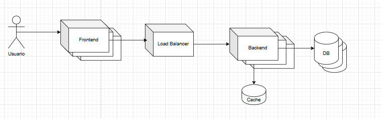

# Deploy

Realizamos el deploy en el ecosistema de AWS. El diagrama de despliegue buscado es el siguiente:

## ECS

El principal servicio utilizado fue Elastic Container Service, que nos permite, a partir de una imágen de docker, levantar una cluster de contenedores, y gestiona el escalado. Esto lo utilizamos tanto para el backend como el frontend. Las imágenes de Docker están almacenadas en un Docker Registry privado que provee AWS

## Redis

Para esto utilizamos ElastiCache de AWS, generando una instancia de Redis en una subred privada, a la cuál solo el backend tiene acceso.

## Mongo

AWS no cuenta con soporte nativo para MongoDB, por lo que decidimos utilizar el servicio de Mongo Atlas, aprovechando la tier gratuita. El servicio es fácil de utilizar, permitiendos tener una corta whitelist de ip autorizadas a entrar, garantizando seguridad.

Dada la imposibilidad de whitelistear todas las IPs de contenedores dinámicos, en un escenario productivo utilizaríamos NAT Gateway para exponer una IP única hacia Atlas y evitar mantenimiento manual de la whitelist. Para esta versión, decidimos dejar 0.0.0.0 en whitelist, no es tan grave ya que mongo tiene contraseña, pero tampoco es ideal.

Uno de los principales beneficios de MongoDB, especialmetne con Atlas, es la escala sencilla, añadir nuevos clusters a la DB es sencillo, y no afecta al backend, que siempre debe golpear a la misma ip.

## Load Balancer

Acá es donde surgen problemas, la tier gratuita de AWS no permite crear un ALB. Esto dificulta fuertemente el modelo de clusters.

### Solución

Un parche encontrardo es mantener la escala automática en el back, con un Service Finder que los identifique, nginx se conecta a este finder para recivir un container. De esta forma, aún si muriese un backend el front va a encontrar remplazo, pero no es un load balancer, los pedidos no serán distribuidos de fomra eficiente, sino que cada 30 segundos el proxy inverso cambiará a que container le pega

## DNS y Frontend Estable

La versión que tenemos de AWS no nos pemrite elegir un nombre de domiño y asociarlo a nuestra instancia de front (o varias si necesitacemos escalar eso también). Tenemos un container de front levantado, y para conectarse se entra a esa ruta.
