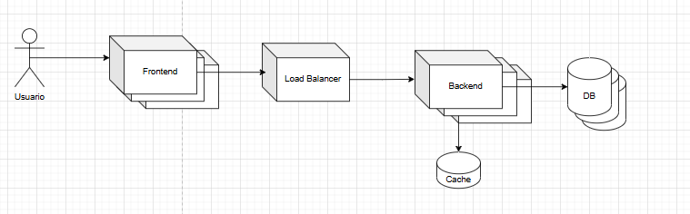

# Deployment

We deployed the application within the AWS ecosystem. The target deployment diagram is as follows:

## ECS

The primary service used was Elastic Container Service (ECS), which allows us to spin up a container cluster from a Docker image and manages scaling. We used this for both the backend and the frontend. The Docker images are stored in a private Docker Registry provided by AWS.

## Redis

For this, we utilized AWS ElastiCache, generating a Redis instance within a private subnet to which only the backend has access.

## Mongo

AWS does not offer native support for MongoDB, so we decided to use the Mongo Atlas service, taking advantage of the free tier. The service is easy to use, allowing us to maintain a short whitelist of authorized IP addresses, ensuring security.

Given the impossibility of whitelisting all dynamic container IPs, in a production scenario, we would use a NAT Gateway to expose a single IP to Atlas and avoid manual whitelist maintenance. For this version, we decided to leave 0.0.0.0/0 on the whitelist; it is not too severe since Mongo has a password, but it is not ideal either.

One of the main benefits of MongoDB, especially with Atlas, is seamless scaling. Adding new clusters to the DB is simple and does not affect the backend, which always targets the same IP address.

## Load Balancer

This is where problems arise; the AWS free tier does not allow the creation of an ALB (Application Load Balancer). This heavily hinders the cluster model.

### Solution

A workaround we found is to maintain automatic scaling on the backend with a Service Discovery/Finder that identifies them. Nginx connects to this finder to receive a container destination. This way, even if a backend instance dies, the frontend will find a replacement. However, it is not a true load balancer: requests will not be distributed efficiently; instead, every 30 seconds the reverse proxy will change which container it hits.

## DNS and Stable Frontend

The AWS version we have does not allow us to choose a domain name and associate it with our frontend instance (or multiple instances if we needed to scale that as well). We have a single frontend container up and running, and users connect by accessing that specific route directly.